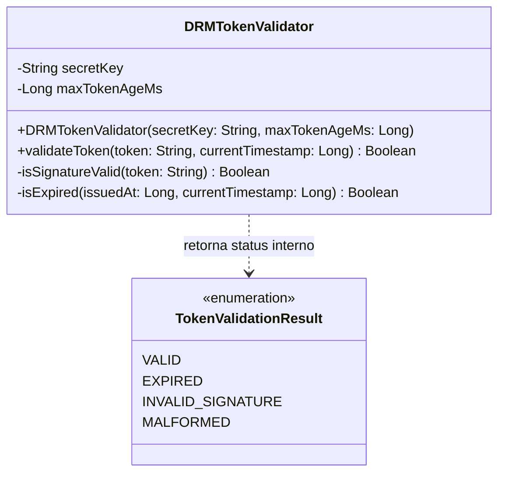

# Laboratório 02 — Estratégias e Níveis de Teste na Prática
**Domínio Escolhido:** Plataforma de Streaming de Vídeo sob Demanda (StreamFlix)  
**Disciplina:** Verificação, Validação e Testes de Software  
**Autor:** Ícaro Pontes

---

## 🏗️ 0. Arquitetura Base do Sistema (StreamFlix)

Para garantir consistência técnica e rastreabilidade nos 13 cenários de teste, este relatório utiliza uma arquitetura padronizada composta pelos seguintes módulos e interfaces:

* **Cliente & Aplicação:** `VideoPlayerClient` (Player no app mobile/web).
* **Serviços de Domínio (Backend):**
  * `DRMTokenValidator` (Validação de tokens de direitos digitais).
  * `StreamingSessionService` (Gerenciamento de sessões ativas de reprodução).
  * `VideoCatalogService` (Catálogo e metadados de títulos).
  * `AuthService` (Autenticação e controle de acesso).
  * `VideoRepository` (Camada de persistência de dados de vídeo).
* **Interfaces & Gateway Externos:**
  * `ICDNProvider` (Interface para distribuidoras de conteúdo / CDN).
  * `IPaymentGateway` (Interface de processamento de assinaturas).
* **Infraestrutura:** `UserDatabase` (Banco de dados de usuários), `MediaStorageS3` (Armazenamento de mídia bruta).

---

## 1. Teste de Unidade (Unit Testing)

### 1.1 Verificação de Lógica Atômica em Componente Isolado

#### Diagrama de Classes UML

# Documentação do Cenário de Teste

## Componente sob Teste
* **Classe:** `DRMTokenValidator`
* **Responsabilidade:** Validar atomicamente a autenticidade e a validade temporal de tokens de autorização de mídia (DRM) antes de permitir a liberação do fluxo de vídeo.

---

## Operação do Teste
* **Método Testado:** `validateToken(token, currentTimestamp)` (método público)
* **Modo de Execução:** Teste unitário exercitado de forma **100% pura na memória**.
* **Isolamento:** Sem dependências externas como banco de dados, rede ou servidores externos de licença.

---

## Detecção de Defeitos
O teste visa identificar:
1. **Falhas na lógica temporal:** Erros matemáticos/booleanos no cálculo de expiração (`isExpired`).
2. **Falhas de autenticidade:** Erros na verificação de hash HMAC da assinatura (`isSignatureValid`).
3. **Tratamento de exceções:** Respostas incorretas ao receber strings nulas ou malformatadas.
